# ForSysXR

<!--- README.md is generated from README.Rmd. Please edit that file -->


## Scenario planning for land management

ForSys was developed by the Forest Service Rocky Mountain Research Station to provide a platform for prioritizing risk reduction and restoration investments using spatial optimization methods that are widely used in conservation planning and the forest industry.  The development of ForSys was motivated by gaps in decision support tools for rendering the growing number of Forest Service land condition assessments into optimized project areas as part of prioritization and planning efforts. ForSys is designed around the concept that restoration and risk reduction activities occur at the stand polygon scale (1-20 ha; 2.5 – 50 acres) that need to be organized into project areas (5,000 – 25,000 acres) to achieve landscape-scale management goals and meet logistical and administrative constraints. ForSys solves typical spatial planning problems where treatments are allocated to optimize one or more restoration objectives accounting for multiple hierarchical spatial constraints and treatment thresholds. ForSys integrates forest landscape planning, spatial optimization, and the science and literature on scenario analyses that emphasize the importance of examining large arrays of management scenarios and considering uncertain future disturbances. ForSys has been applied to prioritization projects at a range of scales, including sub-watershed projects, national forests, regions, and the entire national forest network.


This tutorial was designed to illustrate the program’s basic functionality, familiarize the user with inputs and results using a simple example ForSysX run, and provide data descriptions and preparation recommendations for users who wish to use local datasets within the program.

More detailed information can be obtained from the full [ForSysX manual](https://github.com/forsys-sp/forsysr). 
Note that the ForSys platform currently exists in three formats: 1) an executable C++ desktop application (ForSysX), 2) a publicly available R package ([ForSysR](https://github.com/forsys-sp/forsysr)), and 3) a DLL created from the C++ that can be wrapped within other applications. This tutorial covers only the use of the DLL wrapped in a new R package that executes C++ (ForSysX) from R. 


## Installation

The latest official version of the _forsysr_ package can be installed from [GitHub](https://github.com/forsys-sp/ForSysXR/) using the following code. The repository is currently private, which means that you need to create a personal access token to install the package in R. The token can be generated by going to the following url (https://github.com/settings/tokens): (1) log into your github account, (2) add a brief description to the token (required), (3) set the expiration date, and (4) click on the checkbox for 'repo'. Add that token text string to the _remotes::install_github_ function below and R will download and install the forsysr package to your computer. We recommend updating other packages when prompted.

```{r, eval = FALSE}
if (!require(remotes)) install.packages("remotes")
remotes::install_github("forsys-sp/ForSysXR", auth_token = 'your_token_here')
```


<!--For the moment, ForSysXR is not public. To install the package on your machine, please download the zipped package [here](https://github.com/forsys-sp/ForSysXR/archive/master.zip).

After the download, install the package as follows

``` r
library("devtools")
install_local(path = "C:/Users/Downloads/ForSysXR-main.zip")
```-->

<!--The current official version of the *forsys* package can be installed
from [GitHub](https://github.com/forsys-sp/ForSysXR/) using the following
code. 

We recommend updating other packages when prompted.

``` r
if (!require(remotes)) install.packages("remotes")
remotes::install_github("forsys-sp/ForSysXR")
```-->

After installing the ForSysXR package, the user needs to download
and unzip the ForSysXDLL from
[here](https://github.com/bmaparicio/ForSysXR/raw/main/ForSysXDLLDist_2023-11-16.zip).
This step is crucial as it downloads the ForSysX executable that will later
be run from R.

## Usage

Below we demonstrate how the *ForSysXR* package can be used and highlight the flexibility of the algorithm in solving multiple problems.
For simplicity, the dataset used is distributed with the package. First, we will
load the *forsysXR* package.

``` r
library(ForSysXR)

# In order to run the examples below, these additional libraries are required:
library(sf)
library(dplyr)
library(ggplot2)
library(ggpubr)
```

### Loading data

Although *forsys* can support many different types of treatment unit
data, here our treatment units are represented as polygons in a spatial
vector format. Each polygon represents a different treatment unit. 
Please note that geodatabase format is not supported by *ForSysX*. Only shapefile format is currently supported.

``` r
# load treatment unit data
data(stands_data)
# show the first rows in the attribute table
head(stands_data)
```

    ## Simple feature collection with 6 features and 10 fields
    ## Geometry type: POLYGON
    ## Dimension:     XY
    ## Bounding box:  xmin: 571829.6 ymin: 4449945 xmax: 577284.2 ymax: 4455392
    ## Projected CRS: ETRS89 / UTM zone 29N
    ##   Stand_ID  Area_ha  X_Coord Y_Coord availuse water     obj_1    obj_2
    ## 1        1 2.149784 577104.1 4455304        1     0  649.1051 2.632802
    ## 2        2 1.307183 571959.4 4450037        1     0 1092.8525 2.421031
    ## 3        3 1.313889 572198.1 4450204        1     0 1072.2005 2.397908
    ## 4        4 1.283715 576908.8 4451242        1     0  252.8004 2.378386
    ## 5        5 1.393932 577108.5 4451299        1     0  269.7420 2.388572
    ## 6        6 1.077390 574488.3 4452205        1     0  146.1724 2.339832
    ##   obj_3        threshold                  geometry
    ## 1 0.0017115583  1.750002 POLYGON ((577284.2 4455239,...
    ## 2 0.0004543819  1.627590 POLYGON ((571986 4450002, 5...
    ## 3 0.0008986479  1.996994 POLYGON ((572168.8 4450285,...
    ## 4 0.0037384391  2.315409 POLYGON ((576948.2 4451149,...
    ## 5 0.0038692370  2.815383 POLYGON ((577192.4 4451290,...
    ## 6 0.0020394307  1.976931 POLYGON ((574485.3 4452268,...

``` r
# plot the treatment units
plot(stands_data[,1])
```

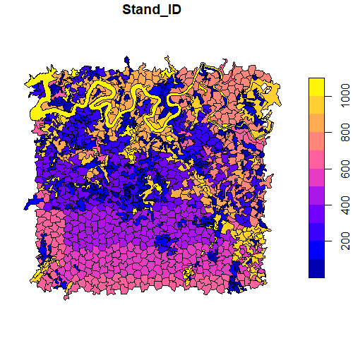

The figure plotted shows the stands in the study area. It is composed of 1028 different stands.

It is also useful to plot the objectives, available stands, and stands that should be excluded.

``` r
# plot the objectives, availability and excluded stands
plot_1 <- stands_data  %>%
  mutate_at(c('obj_1'), ~na_if(., 0)) %>%
  ggplot() +
  geom_sf(aes(fill=obj_1),colour=NA) +
  scale_fill_viridis_c(option = "A",na.value = "grey50")+
  ggtitle("Objective 1") +
  theme_void()+
  theme(plot.title=element_text(hjust=0.5))


plot_2 <- stands_data  %>%
  mutate_at(c('obj_2'), ~na_if(., 0)) %>%
  ggplot() +
  geom_sf(aes(fill=obj_2),colour=NA) +
  scale_fill_viridis_c(option = "A",na.value = "grey50")+
  ggtitle("Objective 2") +
  theme_void()+
  theme(plot.title=element_text(hjust=0.5))


plot_3 <- stands_data  %>%
  mutate_at(c('obj_3'), ~na_if(., 0)) %>%
  ggplot() +
  geom_sf(aes(fill=obj_3),colour=NA) +
  scale_fill_viridis_c(option = "A",na.value = "grey50")+
  ggtitle("Objective 3") +
  theme_void()+
  theme(plot.title=element_text(hjust=0.5))


plot_4 <- stands_data  %>%
  ggplot() +
  geom_sf(aes(fill=factor(availuse)),colour=NA) +
  ggtitle("Availability") +
  theme_void()+
  theme(plot.title=element_text(hjust=0.5))+
  guides(fill=guide_legend(title="Availab"))


plot_5 <- stands_data  %>%
  ggplot() +
  geom_sf(aes(fill=factor(water)),colour=NA) +
  ggtitle("Exclude") +
  theme_void()+
  theme(plot.title=element_text(hjust=0.5))+
  guides(fill=guide_legend(title="Exclude"))


ggarrange(plot_1,plot_2,plot_3,plot_4,plot_5,nrow=3,ncol=2)

```
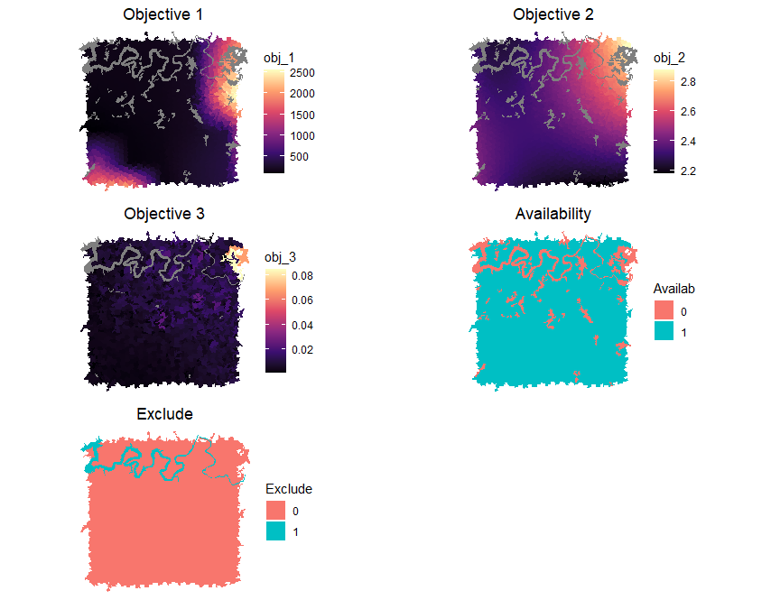


## Before running a ForSys Scenario

ForSysX (and ForSysXR) require that fields in the input shapefile follow a specific format. 
Hence, before setting a ForSys run, it is highly recommended to evaluate if the shapefile can be used without issues. If issues are detected, they can easily be corrected within the ForSysXR package.

To evaluate the validity of the input shapefile, one can do as follows:

``` r
check_input_shapefile(input_shapefile =  stands_data,
                      stand_id="Stand_ID",
                      area="Area_ha",
                      available="availuse",
                      exclude_field="water",
                      subunit_field="subunit",
                      make_valid = TRUE)
```
    ## All fields match ForSysX required formats. The input shapefile was not updated.

The message above means that the input shapefile is ready to be used in ForSysXR as no issues were found. 
As an example of what to expect when issues are found and how to easily solve it, one can modify the existing shapefile and re-run the the check_input_shapefile, this time with make_valid set to FALSE

``` r
modified_stands_data <- stands_data

#change the fields Stand_ID and availuse from integer to numeric. This should trigger
#an issue as ForSysXR require these fields to be integer
modified_stands_data$Stand_ID <- as.numeric(modified_stands_data$Stand_ID)
modified_stands_data$availuse <- as.numeric(modified_stands_data$availuse)

check_input_shapefile(input_shapefile =  modified_stands_data,
                      stand_id="Stand_ID",
                      area="Area_ha",
                      available="availuse",
                      exclude_field="water",
                      subunit_field="subunit",
                      make_valid = FALSE)
```
    ## Changes in the input shapefiles are required. 
    ## Re-run check_input_shapefile with make_valid = TRUE if you wish to correct and overwrite the current shapefile in the golbal environment (does not change the shapefile in local machine). 
    ## The problems found with the shapefile are listed below: 
    ## • The stand id field is not an integer 
    ## • The available field is not an integer 

To easily correct the issues, one can set the make_valid back to TRUE. This will overwrite the shapefile (either in the global environment when the shapefile is loaded in R, or on the local machine when the input_shapefile is the path for the file in the user's machine). Note that the default is true.

``` r
check_input_shapefile(input_shapefile =  modified_stands_data,
                      stand_id="Stand_ID",
                      area="Area_ha",
                      available="availuse",
                      exclude_field="water",
                      subunit_field="subunit",
                      make_valid = TRUE)
```
    ## The input shapefile in the global environment was updated. The following fields were updated to match ForSysX required formats: 
    ## • Stand_ID 
    ## • availuse

To be completely sure that the shapefile was corrected, one can also do as follows:

``` r
str(modified_stands_data)
``` 

    ## Classes ‘sf’ and 'data.frame':	1028 obs. of  12 variables:
    ## $ Stand_ID : int  1 2 3 4 5 6 7 8 9 10 ...
    ## $ Area_ha  : num  2.15 1.31 1.31 1.28 1.39 ...
    ## $ X_Coord  : num  577104 571959 572198 576909 577109 ...
    ## $ Y_Coord  : num  4455304 4450037 4450204 4451242 4451299 ...
    ## $ availuse : int  1 1 1 1 1 1 1 1 1 1 ...
    ## $ water    : int  0 0 0 0 0 0 0 0 0 0 ...
    ## $ obj_1    : num  649 1093 1072 253 270 ...
    ## $ obj_2    : num  2.63 2.42 2.4 2.38 2.39 ...
    ## $ obj_3    : num  0.001712 0.000454 0.000899 0.003738 0.003869 ...
    ## $ threshold: num  1.75 1.63 2 2.32 2.82 ...
    ## $ subunit  : int  2 1 1 2 2 2 2 2 2 2 ...

As showed above, the Stand_ID and the availuse fields are integers and no longer numeric.
Note that in this function, only the parameters input_shapefile, stand_id, and area are mandatory. However, we recommend validating all the fields listed above whenever they are present in the input shapefile.


## Running a ForSys Scenario

*Forsys* prioritizes projects by maximizing an objective given one or
more constraints. The objectives represent one or more management
priorities, while a constraint can be perceived as the condition required to stop the prioritization process. Common constraints are total area treated and/or total cost.
Thresholds are environmental or categorical conditions that
trigger the need to treat an individual treatment unit or stand (e.g., 
distance to road or minimum forest cover). *Forsys* then builds
projects and ranks them in order of their priority. Projects can be
either predefined units (e.g., watersheds) or can be built dynamically.

The example below sets a simple *ForSysX* run. It uses the stands_data shown above to delineate the top 50 ha
within each predefined project based on ‘priority1’. This run defines a total of 10 projects of 50 ha each.


``` r
#To increase the flow of this tutorial, we can start by storing some paths
#as variables since they will be present in almost all the upcoming exercises.

my_output_folder <- "C:/Users/ForSysXR"
my_exe_path <-"C:/Users/ForSysXR/ForSysXConsole.exe"

set_forsysx_run (input_shapefile = stands_data,
                 outputs_base_name = paste(my_output_folder,"run_tutorial_1",sep="/"),
                 stand_id = "Stand_ID",
                 area = "Area_ha",
                 available = "availuse",
                 exclude_field = "water",
                 seed_stands_only_available_stands = 1,
                 x_coordinate = "X_Coord",
                 y_coordinate = "Y_Coord",
                 max_number_projects = 10,
                 output_adjacency_matrix = my_output_folder,
                 constraints_name = "Area_ha",
                 constraints_value = "50.00",
                 constraints_slack = "1.00",
                 effect_fields = c("obj_1","obj_2","obj_3"),
                 objectives = c("obj_1","Treat","1","1","1"),
                 output_xml = paste(my_output_folder,"tutorial_objective1.xml",sep="/"),
                 run_forsysx = 1,
                 plot_results=TRUE,
                 exe_path = my_exe_path,
                 save_outputs = c("stand_csv","shapefile","image"))
```

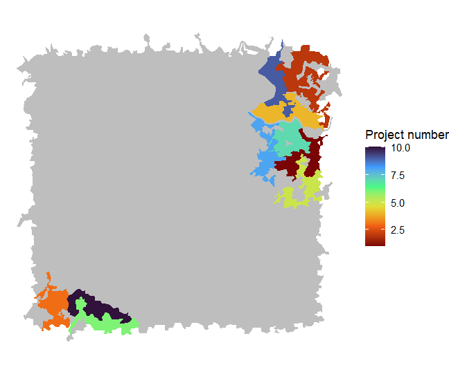


Not surprisingly, the treatment rank of the projects selected
corresponds directly to those areas where obj_1 was highest, as
plotted above. Project rank \#1 (darkest red) is the highest-ranked
project.


The amount of objective targeted for treatment per project can be plotted as follows:


``` r
result_table <- read.csv(paste(my_output_folder,"run_tutorial_1_Results.csv",sep="/"))

ggplot(result_table,aes(x=ProjectNumber,y=ETrt_obj_1))+
  geom_line()+
  scale_x_continuous(breaks = 1:10)+
  xlab("Objective attainment")+
  ylab("Project number")+
  theme_classic()
```

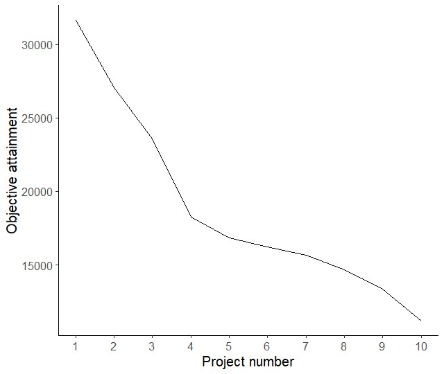


## Using a treatment threshold 

It is possible to define a treatment threshold in ForSys. For instance, a given stand may be available for treatment, but if it does not contain a certain value of biomass or any fire metric, it may not be targeted for treatment. Here, the field threshold represents the predicted flame length in meters. As an example, one could limit the treatments to be allocated only in areas with predicted flame lengths greater than 2 meters.


We run *forsys* with the following arguments. Note the use of adjacency_matrix (uses the adjacency created above instead of generating a new file) and the parameter threshold.

``` r
set_forsysx_run (input_shapefile = stands_data,
                 outputs_base_name = paste(my_output_folder,"run_tutorial_threshold_2",sep="/"),
                 stand_id = "Stand_ID",
                 area = "Area_ha",
                 available = "availuse",
                 exclude_field = "water",
                 seed_stands_only_available_stands = 1,
                 x_coordinate = "X_Coord",
                 y_coordinate = "Y_Coord",
                 max_number_projects = 10,
                 adjacency_matrix = paste(my_output_folder,"adjacency_matrix_forsys.csv",sep="/"),
                 constraints_name = "Area_ha",
                 constraints_value = "50.00",
                 constraints_slack = "1.00",
                 effect_fields = c("obj_1","obj_2","obj_3"),
                 objectives = c("obj_1","Treat","1","1","1"),
                 output_xml = paste(my_output_folder,"run_tutorial_threshold_2.xml",sep="/"),
                 run_forsysx = 1,
                 plot_results=TRUE,
                 exe_path = my_exe_path,
                 threshold=c("threshold",">",2),
                 save_outputs = c("stand_csv","shapefile","image"))
```

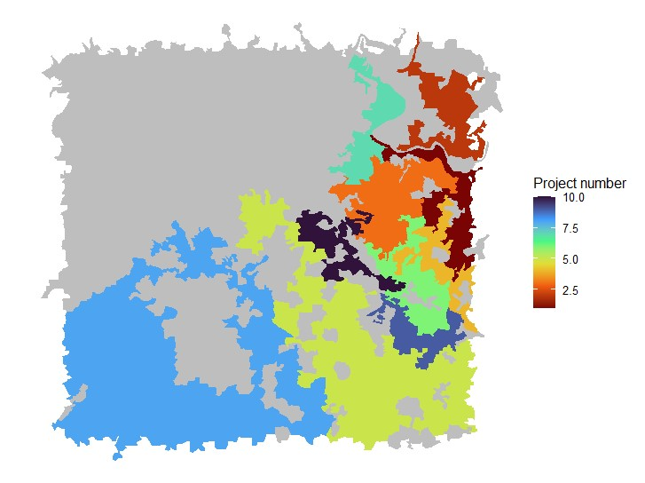


To assess the impact of the use of the threshold in the treated area in each project, one can run the following script

``` r
output_threshold <- sf::st_read(paste(my_output_folder,"run_tutorial_threshold_2_1_2_49-50.shp",sep="/")) %>%
  filter(Treat==1)

plot_1 <- stands_data  %>%
  mutate(threshold_bin = ifelse(threshold > 2, 1, 0)) %>%
  ggplot() +
  geom_sf(aes(fill=factor(threshold_bin)),colour=NA) +
  scale_fill_manual(values = c("gray50", "gray"),
                    labels=c('Below threshold', 'Above threshold'))+
  ggtitle("Threshold") +
  theme_void()+
  theme(plot.title=element_text(hjust=0.5))+
  geom_sf(data=output_threshold,aes(color=factor(Treat)),fill=NA)+
  scale_color_manual(values=c("black"),
                     labels="Treat")+
  guides(fill=guide_legend(title=""),
         color=guide_legend(title=""))
plot_1
```


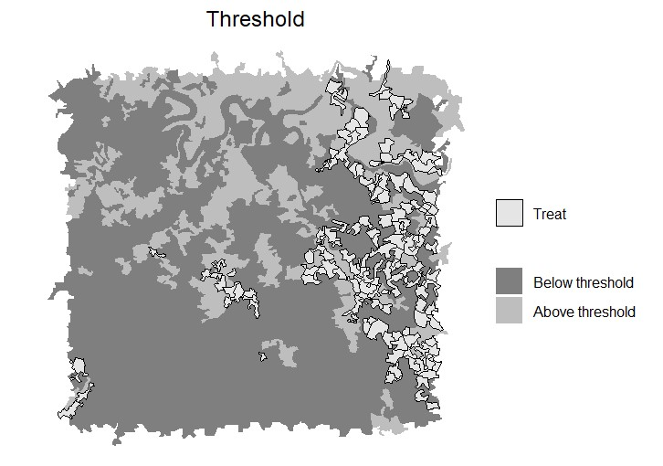

As shown in the figure above, only stands above the threshold are targeted for treatments.


## Using more than one treatment threshold 

It is also possible to define more than one treatment threshold in ForSys. Multiple thresholds can be specified by simply adding more factors to the threshold parameter. 


``` r
set_forsysx_run (input_shapefile = stands_data,
                 outputs_base_name = paste(my_output_folder,"run_tutorial_threshold_2",sep="/"),
                 stand_id = "Stand_ID",
                 area = "Area_ha",
                 available = "availuse",
                 exclude_field = "water",
                 seed_stands_only_available_stands = 1,
                 x_coordinate = "X_Coord",
                 y_coordinate = "Y_Coord",
                 max_number_projects = 10,
                 adjacency_matrix = paste(my_output_folder,"adjacency_matrix_forsys.csv",sep="/"),
                 constraints_name = "Area_ha",
                 constraints_value = "50.00",
                 constraints_slack = "1.00",
                 effect_fields = c("obj_1","obj_2","obj_3"),
                 objectives = c("obj_1","Treat","1","1","1"),
                 output_xml = paste(my_output_folder,"run_tutorial_threshold_2.xml",sep="/"),
                 run_forsysx = 1,
                 plot_results=TRUE,
                 exe_path = my_exe_path,
                 threshold=c("threshold",">",2,
                             "obj_1",">=",1),
                 save_outputs = c("stand_csv","shapefile","image"))
```


## Exploring different project prioritization methods

*Forsys* can build projects with different shapes and follow different methods. 
The first parameter one can change is the Inverse Distance Power (IDP). This parameter controls how the project should be clustered together. A high IDP value will result in more tightly clumped stands in a project area, but sacrifices the overall objective. In *ForSysXR* the parameter is called ```inverse_distance_power``` and can be used as follows

``` r
set_forsysx_run (input_shapefile = stands_data,
                 outputs_base_name = paste(my_output_folder,"run_tutorial_IDP_1",sep="/"),
                 stand_id = "Stand_ID",
                 area = "Area_ha",
                 available = "availuse",
                 exclude_field = "water",
                 seed_stands_only_available_stands = 1,
                 x_coordinate = "X_Coord",
                 y_coordinate = "Y_Coord",
                 max_number_projects = 10,
                 output_adjacency_matrix = my_output_folder,
                 constraints_name = "Area_ha",
                 constraints_value = "50.00",
                 constraints_slack = "1.00",
                 effect_fields = c("obj_1","obj_2","obj_3"),
                 objectives = c("obj_1","Treat","1","1","1"),
                 output_xml = paste(my_output_folder,"tutorial_objective1.xml",sep="/"),
                 run_forsysx = 1,
                 plot_results=TRUE,
                 exe_path = my_exe_path,
                 threshold=c("threshold",">",2),
                 inverse_distance_power=3,
                 save_outputs = c("stand_csv","shapefile","image"))
```

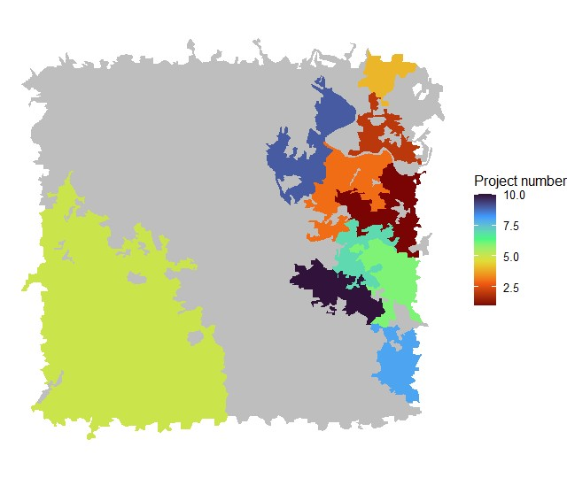


The figure above shows the projects when considering the same threshold as previously but with an inverse distance power of 3. As illustrated, now the projects are more clustered together than when not using any IDP.


## Multiple priorities

In many prioritization studies, more than one objective is often considered.  When this is the case, it is advised that the real values are not used directly in ForSysX as the magnitude of the objectives' values are often different. Two clear examples of that are objective 1 (ranges from 0 to 2569) and objective 3 (ranges from 0 to 0.0848). If these values are used directly in ForSys, the priority areas would be defined based on objective 1 instead of on both.

ForSysX and ForSysXR allow the user to normalize the objectives using the PCP (percentage contribution concerning the total problem of all treatable units) and SPM (percentage difference from the maximum value of the objective). Hence, the sum of the PCP of all stands is 100 and the maximum SPM value of any stand is 100. Usually, the SPM is used as an objective and the PCP as an effect.


Note that it is important to consider stand size in these calculations, otherwise stand selection will be biased towards
larger stands. For datasets where there is a large range in stand size, metrics should be
weighted to account for size. The Calculate PCP and SPM function has the option to Multiply
by area of stand to automatically account for stand size in calculation. 


To normalize the objectives, the function normalize_objectives can be used

``` r
normalize_objectives(stands_data,
                     fields = c("obj_1","obj_2","obj_3"),
                     availability_txt = "availuse",
                     output_name = my_output_folder)

## Simple feature collection with 1028 features and 16 fields
## Geometry type: POLYGON
## Dimension:     XY
## Bounding box:  xmin: 571404.6 ymin: 4448921 xmax: 579181 ymax: 4456309
## Projected CRS: ETRS89 / UTM zone 29N
## First 10 features:
##   Stand_ID  Area_ha  X_Coord Y_Coord availuse water     obj_1    obj_2        obj_3 threshold
##1         1 2.149784 577104.1 4455304        1     0  649.1051 2.632802 0.0017115583  1.750002
##2         2 1.307183 571959.4 4450037        1     0 1092.8525 2.421031 0.0004543819  1.627590
##3         3 1.313889 572198.1 4450204        1     0 1072.2005 2.397908 0.0008986479  1.996994
##4         4 1.283715 576908.8 4451242        1     0  252.8004 2.378386 0.0037384391  2.315409
##5         5 1.393932 577108.5 4451299        1     0  269.7420 2.388572 0.0038692370  2.815383
##6         6 1.077390 574488.3 4452205        1     0  146.1724 2.339832 0.0020394307  1.976931
##                         geometry obj_1_SPM obj_2_SPM obj_3_SPM  obj_1_PCP obj_2_PCP   obj_3_PCP
##1  POLYGON ((577284.2 4455239,... 25.264164  91.44424  6.847841 0.15205560 0.1149056 0.029964043
##2  POLYGON ((571986 4450002, 5... 42.535493  84.08887  1.817954 0.25600530 0.1056631 0.007954809
##3  POLYGON ((572168.8 4450285,... 41.731688  83.28573  3.595436 0.25116750 0.1046539 0.015732519
##4  POLYGON ((576948.2 4451149,...  9.839378  82.60767 14.957268 0.05921955 0.1038019 0.065448396
##5  POLYGON ((577192.4 4451290,... 10.498772  82.96146 15.480582 0.06318820 0.1042465 0.067738260
##6  POLYGON ((574485.3 4452268,...  5.689255  81.26859  8.159638 0.03424151 0.1021192 0.035704064
```

After running the normalize_objective function, a shapefile named *forsysXR_stands_normalized* is stored in the output_name specified.
This shapefile will be used to run ForSysX with multiobjectives. In the example, all three objectives will be used.


``` r
set_forsysx_run (input_shapefile = paste(my_output_folder,"forsysXR_stands_normalized.shp",sep="/"),
                 outputs_base_name = paste(my_output_folder,"run_tutorial_multiobjectives",sep="/"),
                 stand_id = "Stand_ID",
                 area = "Area_ha",
                 available = "availuse",
                 exclude_field = "water",
                 seed_stands_only_available_stands = 1,
                 x_coordinate = "X_Coord",
                 y_coordinate = "Y_Coord",
                 max_number_projects = 10,
                 adjacency_matrix = paste(my_output_folder,"adjacency_matrix_forsys.csv",sep="/"),
                 constraints_name = "Area_ha",
                 constraints_value = "50",
                 constraints_slack = "1.00",
                 effect_fields = c("obj_1_PCP","obj_2_PCP","obj_3_PCP"),
                 objectives = c("obj_1_SPM","Treat","1","1","1",
                                "obj_2_SPM","Treat","1","1","1",
                                "obj_3_SPM","Treat","1","1","1"),
                 output_xml = paste(my_output_folder,"test_tutorial_multiobjectives.xml",sep="/"),
                 run_forsysx = 1,
                 plot_results=TRUE,
                 exe_path = my_exe_path,
                 save_outputs = c("stand_csv","shapefile","image"))

``` 

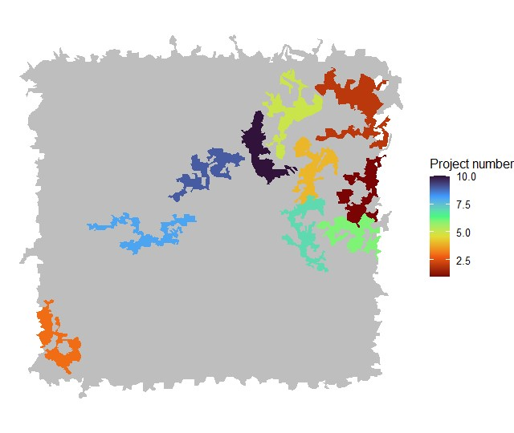

One can plot the attainment for each objective and the overall attainment as follows 

``` r
result_table <- read.csv(paste(my_output_folder,"run_tutorial_multiobjectives_Results.csv",sep="/"))
head(result_table)

#area_treated <- result_table[,"Treat_Area_ha"]
obj1_PCP_treated <- result_table[,c("ProjectNumber","Treat_Area_ha","ETrt_obj_1_PCP")]
obj1_PCP_treated$objective <- 1
colnames(obj1_PCP_treated)<- c("ProjectNumber","Treat_Area_ha","PCP_treated","objective")

obj2_PCP_treated <- result_table[,c("ProjectNumber","Treat_Area_ha","ETrt_obj_2_PCP")]
obj2_PCP_treated$objective <- 2
colnames(obj2_PCP_treated)<- c("ProjectNumber","Treat_Area_ha","PCP_treated","objective")

obj3_PCP_treated <- result_table[,c("ProjectNumber","Treat_Area_ha","ETrt_obj_3_PCP")]
obj3_PCP_treated$objective <- 3
colnames(obj3_PCP_treated)<- c("ProjectNumber","Treat_Area_ha","PCP_treated","objective")

PCP_treated <- rbind(obj1_PCP_treated,obj2_PCP_treated,obj3_PCP_treated)

plot_1 <- ggplot(PCP_treated,aes(x=ProjectNumber, y=PCP_treated, color=factor(objective)))+
  geom_line(linewidth=1.2)+
  scale_x_continuous(breaks = 1:10)+
  xlab("Project number")+
  ylab("Objective attainment (PCP)")+
  guides(color=guide_legend(title="Objective"))+
  ggtitle("Individual attainment") +
  theme(plot.title=element_text(hjust=0.5))+
  theme_classic()+
  theme(text=element_text(size=14))

#alternativelty, one can also plot the overall attainment for the three objective

plot_2 <- ggplot(result_table,aes(x=ProjectNumber,y=max_value))+
  geom_line()+
  scale_x_continuous(breaks = 1:10)+
  xlab("Project number")+
  ylab("Objective attainment")+
  ggtitle("Overall attainment") +
  theme(plot.title=element_text(hjust=0.5))+
  theme_classic()+
  theme(text=element_text(size=14))


ggarrange(plot_1,plot_2,ncol=2)
```

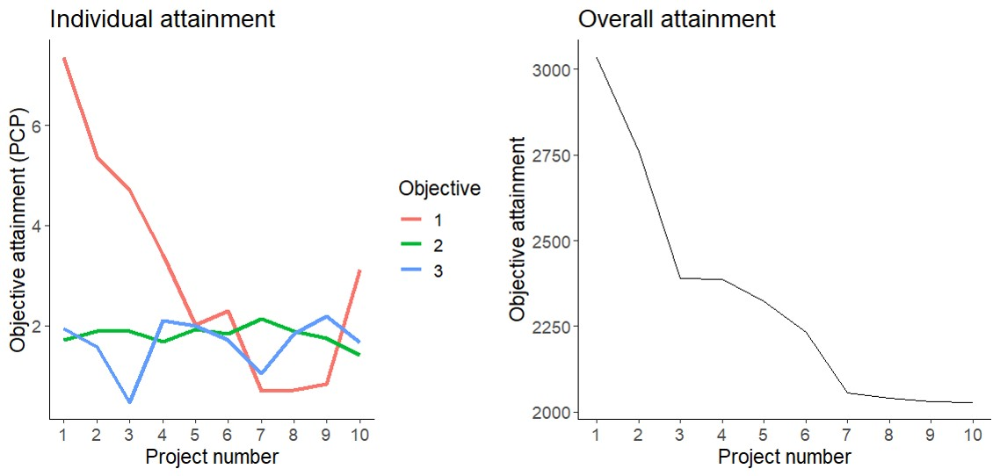


## Running ForSys with subunits

ForSys can also be constrained by subunits. This will allow pre-defined planning areas to be used when creating scenarios.
When using pre-defined planning areas, the “subunit_field” must be set to the field that places stands into planning areas.
The following example shows how the ForSysXR can be run with pre-defined planning areas. First, we plot the subunits in the dataset

``` r
stands_data  %>%
  ggplot() +
  geom_sf(aes(fill=factor(subunit)),colour=NA) +
  scale_fill_manual(values=c("grey80","grey40"))+
  #scale_fill_viridis_c(option = "A",na.value = "grey50")+
  ggtitle("Subunits") +
  theme_void()+
  labs(fill='Subunit number')+
  theme(plot.title=element_text(hjust=0.5))
``` 

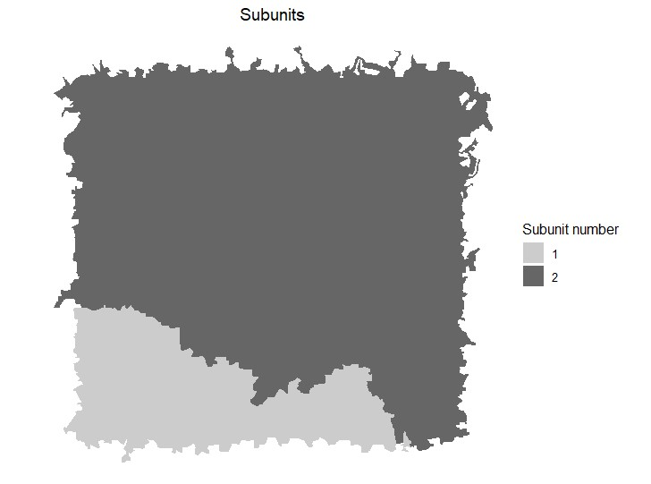


In the following example, we set the number of projects per subunit as three, each with a total treated area of 50 hectares.

``` r
set_forsysx_run (input_shapefile = stands_data,
                 outputs_base_name = paste(my_output_folder,"run_tutorial_subunits",sep="/"),
                 stand_id = "Stand_ID",
                 area = "Area_ha",
                 available = "availuse",
                 exclude_field = "water",
                 seed_stands_only_available_stands = 1,
                 x_coordinate = "X_Coord",
                 y_coordinate = "Y_Coord",
                 max_number_projects = 3,
                 adjacency_matrix = paste(my_output_folder,"adjacency_matrix_forsys.csv",sep="/"),
                 constraints_name = "Area_ha",
                 constraints_value = 50,
                 constraints_slack = "1.00",
                 effect_fields = c("obj_1","obj_2","obj_3"),
                 objectives = c("obj_1","Treat","1","1","1"),
                 output_xml = paste(my_output_folder,"test_tutorial_subunits.xml",sep="/"),
                 run_forsysx = 1,
                 subunit_field = "subunit",
                 plot_results=TRUE,
                 exe_path = my_exe_path,
                 save_outputs = c("stand_csv","shapefile","image"))
``` 

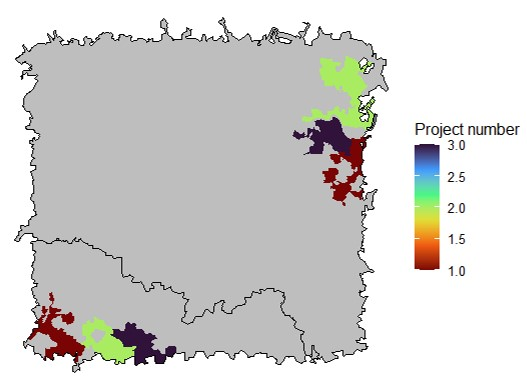


## Running ForSysXR using predefined XML

ForSysXR can be used to run predefined XML files. This can be useful to include in R scripts or loops. This function is similar to run zones in ForSysX

``` r
run_forsysx_xml(exe_path = my_exe_path,
                xml_path = paste(my_output_folder,"run_tutorial_1.xml",sep="/")
``` 


## Running ForSys with zones
Running ForSys with zones allows the user to run several XML files within a single command.
To exemplify the option of running zones in ForSys, we will use another dataset included in the package. 
The new dataset is called `stands_data_FBN` and includes real stands from a study area with one objective that can be optimized, an area field that can be used as a constraint, a field representing the distance to the fuelbreak network to be used as a threshold, and a field with the order of execution of the fuelbreak network. It also contains fields with the stands' availability for treatments and stands to be excluded from the analysis.

First, one can plot the new stand dataset highlighting the predefined fuel break network projects as follows (note that stands that are not part of the fuelbreak network will be displayed as NA)

``` r
data("stands_data_FBN")
head(stands_data_FBN)

stands_data_FBN  %>%
  mutate_at(c('FBN_rank'), ~na_if(., 0)) %>%
  ggplot() +
  geom_sf(aes(fill=factor(FBN_rank))) +
  scale_fill_viridis_d(option = "A",na.value = "grey60")+
  ggtitle("Fuelbreak network projects") +
  theme_void()+
  theme(plot.title=element_text(hjust=0.5))+
  guides(fill=guide_legend(title="FBN number"))
```

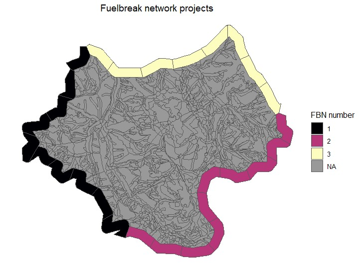


As illustrated in the image above, there are three fuelbreak network projects. The number 1 is the most priority one and should be implemented first, while the third project has the least priority. 
To understand the use of zones, we can set the following research problem:
i) After implementing a fuelbreak network project, we want to create a restoration project in the landscape before moving to the second fuelbreak network project
ii) The restoration project must be within a given distance of the fuelbreak network project that was just implemented.


Given the objectives, we will need to create three different shapefiles, where the distance to the most recently implemented fuelbreak network project changes.

``` r
distance_to_FBN_projects <- function(my_stands,FBN_projects,output_folder){
  if(class(my_stands)[1]=="character"){
    my_stands_use <- sf::st_read(my_stands)}
  
  if(class(my_stands)[1]=="sf"){
    my_stands_use <-(my_stands)}
    
  #get the position of the variable with FBN projects
  FBN_porj_position <- grep(FBN_projects, colnames(my_stands_use))
  names(my_stands_use)[FBN_porj_position] <- "FBN_proj"
  my_linear_projs <-  subset(my_stands_use,FBN_proj!=0)

  for(i in 1:max(my_stands_use$FBN_proj,na.rm = TRUE)){
    my_linear_projs_loop <- subset(my_stands_use,FBN_proj==i)
    # create an index of the nearest feature
    index <- sf::st_nearest_feature(x = my_stands_use, y = my_linear_projs_loop)
    my_FBN_2 <- my_linear_projs_loop %>% slice(index)
    poly_dist <- as.numeric(sf::st_distance(x = my_stands_use, y= my_FBN_2, by_element = TRUE))
    my_stands_use$distance <- poly_dist
    my_stands_final <- my_stands_use
    
    #create a temp folder
    dir.create(file.path(output_folder, "temp_folder_shp"), showWarnings = FALSE)
    sf::st_write(my_stands_final,paste(output_folder, "/temp_folder_shp/","interactive_zones_",i,".shp",sep=""))}}


distance_to_FBN_projects(my_stands=stands_data_FBN,
                         FBN_projects="FBN_rank",
                         output_folder="C:/Users/ForSysXR")
```


This function will create three shapefiles (one for each fuelbreak network project) with the corresponding distance to the newest fuelbreak network project.
The shapefiles are named interactive_zones and are located in a temporary folder inside the path given by the user. This temporary folder can be deleted after running ForSys (see below).


To plot the temporary files created with the corresponding distance to each fuelbreak network project, one can do the following

``` r
for(i in 1:3){
  shp_data_i <- sf::st_read(paste("C:/Users/ForSysXR/temp_folder_shp/interactive_zones_",i,".shp",sep=""))
  
  plot_i <- shp_data_i  %>%
    ggplot() +
    geom_sf(aes(fill=distance),colour=NA) +
    ggtitle(paste("Distance to FBN project ",i,sep="")) +
    scale_fill_viridis_c(option = "inferno",na.value = "grey50",direction=-1)+
    theme_void()+
    theme(plot.title=element_text(hjust=0.5))+
    guides(fill=guide_legend(title="Distance (m)"))
    assign(paste("plot_",i,sep=""),plot_i)
    rm(shp_data_i,plot_i)
}

ggpubr::ggarrange(plot_1,plot_2,plot_3,nrow=1,ncol=3,common.legend = TRUE,legend="bottom")
```

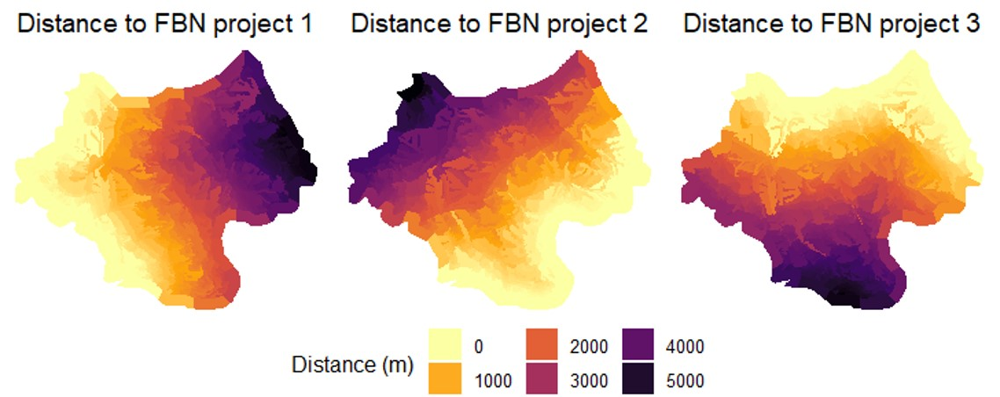


The first step to use ForSysXR is the creation of the XML file that defines the ForSysX run. Because in this case, the only difference between the runs is the input shapefile (i.e. all run parameters should be the same), one can create the XML within a simple for loop in R. This will create the three XML files without running ForSysX

``` r
for(i in 1:3){
  set_forsysx_run (input_shapefile = paste("C:/Users/ForSysXR/temp_folder_shp/interactive_zones_",i,".shp",sep=""),
                   outputs_base_name = paste("C:/Users/ForSysXR/temp_folder_shp/run_tutorial_zones_",i,sep=""),
                   stand_id = "ID_forsys",
                   area = "area_ha",
                   available = "avail_fin",
                   exclude_field = "Exclude",
                   seed_stands_only_available_stands = 1,
                   x_coordinate = "Point_X",
                   y_coordinate = "Point_Y",
                   max_number_projects = 1,
                   output_adjacency_matrix = "C:/Users/ForSysXR/temp_folder_shp",
                   constraints_name = "area_ha",
                   constraints_value = 500,
                   constraints_slack = "1.00",
                   effect_fields = c("ob2_PCP"),
                   objectives = c("ob2_SPM","Treat","1","1","1"),
                   output_xml = paste("C:/Users/ForSysXR/temp_folder_shp/test_tutorial_zones_",i,".xml",sep=""),
                   run_forsysx = 0,
                   threshold=c("distance","<=",2500),
                   save_outputs = c("stand_csv","shapefile","image"))}
``` 


After generating the required XML files, the three XMLs (i.e. zones) can be run using one single command 

``` r
run_forsysx_xml(exe_path="F:/forsys/ForSysXConsole.exe",
                xml_folder="C:/Users/ForSysXR/temp_folder_shp")
``` 


The restoration projects generated from ForSys can be plotted as follows

``` r
all_shps_results <- intersect(list.files("C:/Users/ForSysXR/temp_folder_shp",pattern = "\\.shp$"),
                              list.files("C:/Users/ForSysXR/temp_folder_shp",pattern = "run_tutorial_zones"))
all_shps_results_i <- sf::st_read(paste("C:/Users/ForSysXR/temp_folder_shp",all_shps_results[1],sep="/"))
all_shps_results_i$ProjectNum <- 1

for(j in 2:length(all_shps_results)){
  all_shps_results_j <- sf::st_read(paste("C:/Users/ForSysXR/temp_folder_shp",all_shps_results[j],sep="/"))
  all_shps_results_j$ProjectNum <- j
  all_shps_results_i <- rbind(all_shps_results_i,all_shps_results_j)
}

plot1 <- stands_data_FBN %>%
  filter(!ID_forsys %in% all_shps_results_i$ID_forsys) %>%
  ggplot() +
  geom_sf(fill="grey80",colour=NA)+
  geom_sf(data=all_shps_results_i,aes(fill=factor(ProjectNum)),colour="black",alpha=0.4)+
  ggtitle("Regular run") +
  #scale_fill_viridis_c(option = "inferno",na.value = "grey50",direction=-1)+
  theme_void()+
  theme(plot.title=element_text(hjust=0.5))+
  guides(fill=guide_legend(title="Project number"))

plot1
``` 

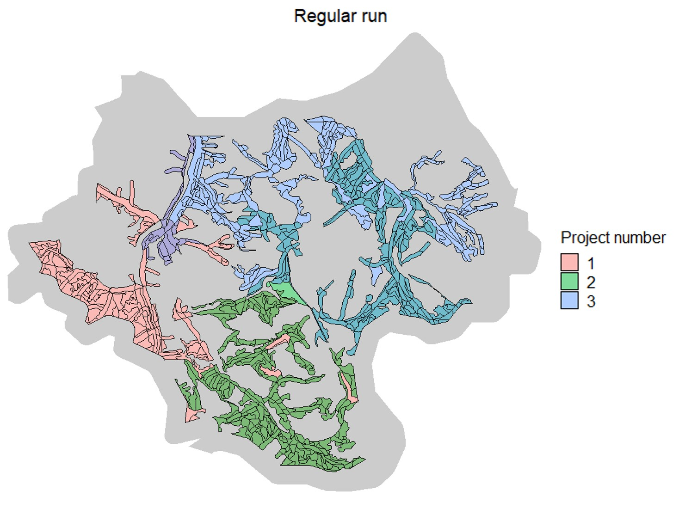

As shown in the figure, three restoration projects were created following the rules set in the XML. Each project is within a distance of 2500 meters from the corresponding fuelbreak network project (i.e. restoration project 1 is within 2500 meters of fuelbreak project 1, etc.).

Although the simple run zones function can be useful, it may not be enough as information on previously allocated projects is not shared between zones (or XML runs). This may result in the overlap of some projects, which can be seen in the figure. To prevent stands from being allocated to more than one project when running zones, one can run zones interactively as shown in the next section.


## Running ForSys with zones interactively
Running ForSys with interactive zones allows the update of fields of the input stand shapefile between runs, preventing stands from being allocated to more than one project. For the moment, this feature is only available in ForSysXR package.

To run ForSysXR with zones interactively one can simply use the parameter ```run_zones_interactive=TRUE```. This parameter updates the exclude field of each shapefile, excluding the stands that were used in previous projects. After updating the field, the shapefile used as input in the XML is updated, replacing the previous version. The results from the previous run will also be overwritten. Zones can be run interactively as follows:

``` r
run_forsysx_xml(exe_path="C:/Users/ForSysXR/ForSysXConsole.exe", 
                xml_folder="C:/Users/ForSysXR/temp_folder_shp",
                run_zones_interactive=TRUE)
``` 


To plot this and the previous result, one can run the following script:  

``` r
all_shps_results <- intersect(list.files("F:/ForSysXR/interactive_zones/temp_folder_shp",pattern = "\\.shp$"),
                              list.files("F:/ForSysXR/interactive_zones/temp_folder_shp",pattern = "run_tutorial_zones"))

all_shps_results_i <- sf::st_read(paste("F:/ForSysXR/interactive_zones/temp_folder_shp",all_shps_results[1],sep="/"))
all_shps_results_i$ProjectNum <- 1

for(j in 2:length(all_shps_results)){
  all_shps_results_j <- sf::st_read(paste("F:/ForSysXR/interactive_zones/temp_folder_shp",all_shps_results[j],sep="/"))
  all_shps_results_j$ProjectNum <- j
  all_shps_results_i <- rbind(all_shps_results_i,all_shps_results_j)
}


plot2 <- stands_data_FBN %>%
  filter(!ID_forsys %in% all_shps_results_i$ID_forsys) %>%
  ggplot() +
  geom_sf(fill="grey80",colour=NA)+
  geom_sf(data=all_shps_results_i,aes(fill=factor(ProjectNum)),colour="black",alpha=0.5)+
  ggtitle("Interactive run") +
  #scale_fill_viridis_c(option = "inferno",na.value = "grey50",direction=-1)+
  theme_void()+
  theme(plot.title=element_text(hjust=0.5),
        plot.margin = margin(0, 0, 0, 0, "cm"),
        legend.text = element_text(size = 12), 
        legend.title = element_text(size = 12), 
        legend.key.size = unit(0.5, 'cm'))+
  guides(fill=guide_legend(title="Project number"))


ggarrange(plot1,plot2,nrow=1,ncol=2,legend="bottom",common.legend = TRUE)

```

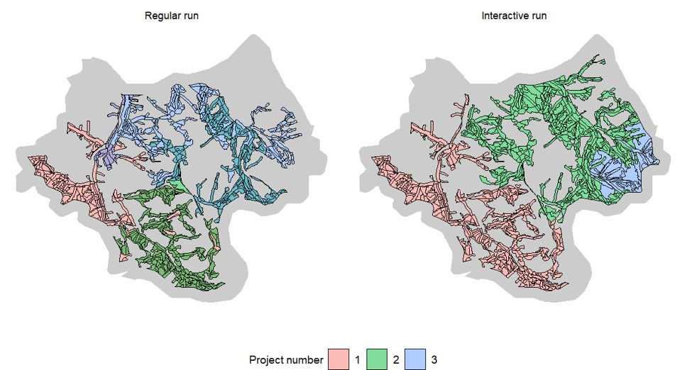


As illustrated by the figure above, the restoration projects generated when running zones interactively differ from the previous case as projects no longer overlap.
The projects are implemented in sequence. This means that the first project only has the limitation imposed in the XML file, while the following projects combine the limitations in the XML with the spatial limitation of including stands that are already part of another project. Hence, only the first project is the same between methods.


## Citation

Please cite the *forsys* package when using it in publications. To cite
the current official version, please use:

> Aparício, B.A., Bunzel, K., Day, M. and  Ager A. (2023).
> ForSysXR: A R package to execute C++ (ForSysX) version of the ForSys scenario planning model. R package version 0.9. Available at
> <https://https://github.com/forsys-sp/ForSysXR>.

## Additional resources

The [package
website](https://www.fs.usda.gov/rmrs/projects/forsys-scenario-planning-model-multi-objective-restoration-and-fuel-management-planning)
contains information on the *forsys* package.

## Getting help

If you have any questions about the *ForSysXR* package or suggestions for
improving it, please [post an issue on the code
repository](https://github.com/bmaparicio/ForSysXR/issues).
